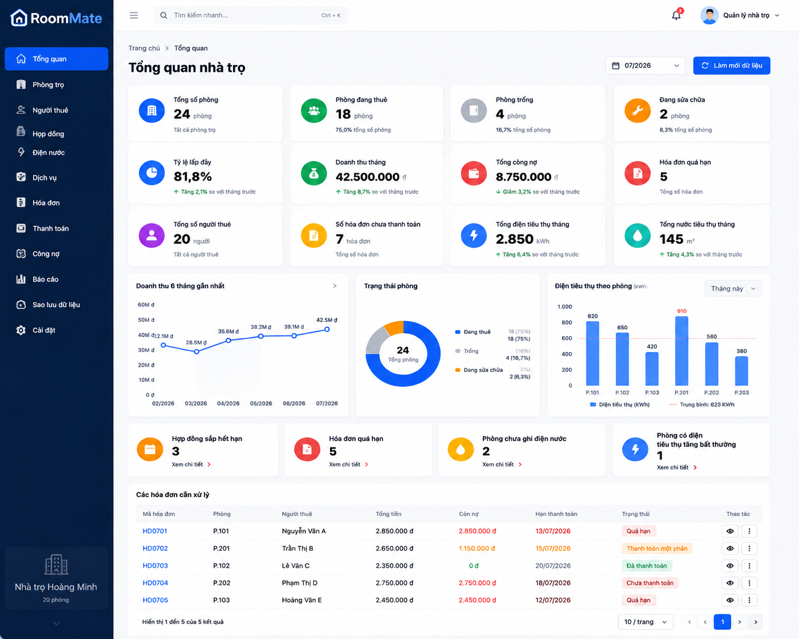

# RoomMate

Hệ thống quản lý nhà trọ và hóa đơn điện nước chạy trực tiếp trên trình duyệt.

[](https://github.com/redgaming2911/roommate/actions/workflows/ci.yml)
[](https://github.com/redgaming2911/roommate/actions/workflows/deploy.yml)

- Thành viên: **Bành Phúc Nguyên**
- Repository: [github.com/redgaming2911/roommate](https://github.com/redgaming2911/roommate)
- GitHub Pages: [redgaming2911.github.io/roommate](https://redgaming2911.github.io/roommate/)

## Mục lục

1. [Giới thiệu](#1-giới-thiệu)
2. [Bài toán](#2-bài-toán)
3. [Chức năng](#3-chức-năng)
4. [Công nghệ](#4-công-nghệ)
5. [Cấu trúc thư mục](#5-cấu-trúc-thư-mục)
6. [Cách cài đặt](#6-cách-cài-đặt)
7. [Chạy môi trường development](#7-chạy-môi-trường-development)
8. [Chạy Vitest](#8-chạy-vitest)
9. [Chạy Playwright](#9-chạy-playwright)
10. [Build dự án](#10-build-dự-án)
11. [Deploy GitHub Pages](#11-deploy-github-pages)
12. [Dữ liệu mẫu](#12-dữ-liệu-mẫu)
13. [Hình ảnh giao diện](#13-hình-ảnh-giao-diện)
14. [Thành viên và phân công](#14-thành-viên-và-phân-công)
15. [Quy trình Git](#15-quy-trình-git)
16. [CI/CD](#16-cicd)
17. [Sử dụng AI](#17-sử-dụng-ai)
18. [Chức năng đã hoàn thành](#18-chức-năng-đã-hoàn-thành)
19. [Hạn chế](#19-hạn-chế)
20. [Hướng phát triển](#20-hướng-phát-triển)

## 1. Giới thiệu

RoomMate là ứng dụng web hỗ trợ quản lý hoạt động của nhà trọ, bao gồm phòng, người thuê, hợp đồng, chỉ số điện nước, dịch vụ, hóa đơn, thanh toán, công nợ và báo cáo thống kê.

Ứng dụng được tổ chức theo các lớp giao diện, nghiệp vụ và dịch vụ. Dữ liệu hiện được lưu bằng LocalStorage, phù hợp cho mục đích học tập, demo và kiểm thử quy trình CI/CD của một ứng dụng frontend.

## 2. Bài toán

Việc quản lý nhà trọ thủ công bằng sổ sách hoặc nhiều bảng tính rời rạc có thể dẫn đến:

- Khó theo dõi trạng thái phòng và số người đang thuê.
- Khó kiểm soát thời hạn hợp đồng.
- Dễ sai khi tính điện, nước và các dịch vụ hàng tháng.
- Khó phân biệt tổng giá trị hóa đơn, số tiền thực thu và công nợ còn lại.
- Khó phát hiện hóa đơn quá hạn hoặc mức tiêu thụ bất thường.
- Khó sao lưu, khôi phục và kiểm tra tính toàn vẹn của dữ liệu.

RoomMate gom các nghiệp vụ này vào một ứng dụng thống nhất và cung cấp dữ liệu tổng hợp phù hợp cho bảng biểu, biểu đồ và cảnh báo.

## 3. Chức năng

### Dashboard

- Tổng hợp số phòng theo trạng thái.
- Hiển thị tỷ lệ lấp đầy và số người thuê hiện tại.
- Theo dõi doanh thu tháng, công nợ và hóa đơn quá hạn.
- Theo dõi điện, nước tiêu thụ trong tháng.
- Biểu đồ doanh thu và trạng thái phòng.
- Danh sách cảnh báo cần xử lý.

### Quản lý phòng

- Thêm, sửa, xóa và tìm kiếm phòng.
- Lọc phòng theo trạng thái.
- Theo dõi giá thuê, sức chứa và trạng thái sử dụng.

### Quản lý người thuê

- Thêm và cập nhật thông tin người thuê.
- Theo dõi trạng thái và thông tin liên hệ.
- Liên kết người thuê với hợp đồng.

### Quản lý hợp đồng

- Tạo và xem hợp đồng thuê phòng.
- Kiểm tra trùng thời gian hợp đồng.
- Kích hoạt và theo dõi trạng thái hợp đồng.
- Đồng bộ trạng thái phòng khi hợp đồng có hiệu lực.

### Điện nước và dịch vụ

- Ghi chỉ số điện, nước theo phòng và tháng.
- Tính lượng tiêu thụ từ chỉ số cũ và mới.
- Kiểm tra chỉ số không hợp lệ hoặc tăng bất thường.
- Cấu hình dịch vụ cố định, theo người, phương tiện hoặc lượng sử dụng.

### Hóa đơn và thanh toán

- Lập hóa đơn từ hợp đồng, chỉ số điện nước và dịch vụ.
- Tính từng khoản, giảm giá và tổng hóa đơn.
- Ngăn tạo hóa đơn trùng phòng và tháng.
- Ghi nhận thanh toán một phần hoặc toàn bộ.
- Cập nhật số tiền đã thu, còn nợ và trạng thái thanh toán.
- Theo dõi và xóa giao dịch thanh toán nhập sai.

### Báo cáo và công nợ

- Doanh thu và tiền thực thu theo tháng.
- Công nợ theo tháng và theo phòng.
- Điện, nước tiêu thụ theo phòng.
- Trạng thái hóa đơn và phương thức thanh toán.
- Hợp đồng sắp hết hạn và các cảnh báo vận hành.

### Sao lưu và khôi phục

- Export toàn bộ dữ liệu thành JSON.
- Kiểm tra file trước khi import.
- Import theo chế độ ghi đè hoặc gộp dữ liệu.
- Tạo backup trước khi ghi đè.
- Xóa toàn bộ dữ liệu hoặc khôi phục dữ liệu mẫu.

## 4. Công nghệ

| Nhóm | Công nghệ |
|---|---|
| Ngôn ngữ | JavaScript ES Modules, HTML5, CSS3 |
| Build tool | Vite 5 |
| Biểu đồ | Chart.js 4 |
| Lưu trữ | Web LocalStorage |
| Unit/business test | Vitest, jsdom |
| E2E test | Playwright, Chromium |
| CI/CD | GitHub Actions |
| Hosting | GitHub Pages |

## 5. Cấu trúc thư mục

```text
roommate/
├── .github/
│   └── workflows/
│       ├── ci.yml                 # Test và build trên CI
│       └── deploy.yml             # Deploy GitHub Pages
├── src/
│   ├── assets/                    # Tài nguyên tĩnh được Vite xử lý
│   ├── business/                  # Tính toán và validation nghiệp vụ
│   ├── components/                # Form, dialog và UI dùng lại
│   ├── constants/                 # Trạng thái, route và storage key
│   ├── data/                      # Dữ liệu mẫu
│   ├── pages/                     # Các trang được hash router tải động
│   ├── services/                  # Truy cập dữ liệu và điều phối nghiệp vụ
│   ├── styles/                    # CSS chung và CSS theo trang
│   ├── utils/                     # Tiện ích ID, ngày, tiền và validation
│   ├── main.js                    # Điểm khởi tạo ứng dụng
│   └── router.js                  # Hash router
├── tests/
│   ├── unit/                      # Unit test
│   ├── business/                  # Test luồng nghiệp vụ
│   └── e2e/                       # Playwright E2E test
├── UI/                            # Ảnh thiết kế và luồng giao diện tham khảo
├── index.html
├── package.json
├── playwright.config.js
├── vite.config.js
├── vitest.config.js
└── README.md
```

## 6. Cách cài đặt

### Yêu cầu

- Node.js 22 được khuyến nghị để đồng nhất với GitHub Actions.
- npm đi kèm Node.js.
- Git nếu cài đặt từ repository.

### Clone và cài dependency

```bash
git clone https://github.com/redgaming2911/roommate.git
cd roommate
npm ci
```

Nếu đang phát triển và chủ động cập nhật dependency, có thể dùng `npm install`. Trong CI nên dùng `npm ci` để cài đúng phiên bản từ `package-lock.json`.

## 7. Chạy môi trường development

```bash
npm run dev
```

Mở địa chỉ được Vite hiển thị, mặc định:

```text
http://127.0.0.1:5173/
```

Ứng dụng sử dụng hash router, ví dụ:

```text
http://127.0.0.1:5173/#/dashboard
http://127.0.0.1:5173/#/rooms
http://127.0.0.1:5173/#/reports
```

## 8. Chạy Vitest

Chạy Vitest ở chế độ theo dõi:

```bash
npm test
```

Chạy toàn bộ test một lần:

```bash
npm run test:run
```

Chỉ chạy unit test:

```bash
npm run test:run -- tests/unit
```

Chỉ chạy business test:

```bash
npm run test:run -- tests/business
```

Chạy test và tạo báo cáo coverage:

```bash
npm run test:coverage
```

Coverage tập trung vào mã nguồn trong `src/business` và `src/services`.

## 9. Chạy Playwright

Cài Chromium cho Playwright:

```bash
npx playwright install chromium
```

Trên Linux hoặc môi trường CI có thể cài kèm system dependencies:

```bash
npx playwright install --with-deps chromium
```

Chạy toàn bộ E2E test:

```bash
npm run test:e2e
```

Mở giao diện Playwright Test UI:

```bash
npm run test:e2e:ui
```

Playwright tự khởi động Vite dev server theo `playwright.config.js`. Các test sử dụng dữ liệu độc lập và dọn LocalStorage trước mỗi kịch bản cần thiết.

## 10. Build dự án

```bash
npm run build
```

Kết quả build được tạo trong thư mục `dist`.

Xem thử production build:

```bash
npm run preview
```

Do ứng dụng được cấu hình cho project site `roommate`, production preview sử dụng base `/roommate/`.

## 11. Deploy GitHub Pages

Workflow `.github/workflows/deploy.yml` tự động deploy khi có push lên nhánh `main`.

Thiết lập repository lần đầu:

1. Mở repository trên GitHub.
2. Chọn **Settings → Pages**.
3. Trong **Build and deployment → Source**, chọn **GitHub Actions**.
4. Push code lên `main` hoặc chạy thủ công workflow **Deploy RoomMate to GitHub Pages**.
5. Theo dõi trạng thái trong tab **Actions**.

```bash
git push origin main
```

Khi workflow hoàn tất, truy cập:

```text
https://redgaming2911.github.io/roommate/
```

Vite dùng base `/roommate/` khi build và preview, nhưng giữ base `/` ở development để không làm thay đổi môi trường local.

## 12. Dữ liệu mẫu

Dữ liệu mẫu nằm trong `src/data/seed-data.js` và gồm:

| Collection | Số bản ghi mẫu |
|---|---:|
| Phòng | 10 |
| Người thuê | 15 |
| Hợp đồng | 8 |
| Cấu hình dịch vụ | 6 |
| Chỉ số điện nước | 3 |
| Hóa đơn | 10 |
| Thanh toán | 8 |

Tại trang **Cài đặt / Sao lưu dữ liệu**:

- **Tạo dữ liệu mẫu** chỉ bổ sung các collection đang trống.
- **Khôi phục dữ liệu mẫu** ghi đè dữ liệu hiện tại bằng bộ seed.
- Nên export backup trước khi khôi phục hoặc xóa dữ liệu.

## 13. Hình ảnh giao diện

Các hình dưới đây là tài liệu thiết kế giao diện tham khảo được lưu trong thư mục `UI`.

### Dashboard



### Báo cáo và thống kê


### Sao lưu và khôi phục


Toàn bộ ảnh thiết kế và sơ đồ luồng có thể xem tại [`UI/`](./UI/).

## 14. Thành viên và phân công

| Thành viên | Phân công |
|---|---|
| Bành Phúc Nguyên | `[CẦN BỔ SUNG: mô tả phần việc và vai trò cụ thể]` |

Thông tin tên nhóm: `[CẦN BỔ SUNG]`.

## 15. Quy trình Git

Quy trình đề xuất cho repository:

1. `main`: mã nguồn ổn định và có thể deploy.
2. `develop`: tích hợp các chức năng đang phát triển.
3. Tạo branch theo chức năng, ví dụ `feature/invoice`, `feature/report` hoặc `fix/payment-validation`.
4. Commit thay đổi theo từng mục tiêu nhỏ, rõ ràng.
5. Push branch và tạo Pull Request vào `develop`.
6. Đảm bảo CI chạy thành công trước khi merge.
7. Tạo Pull Request từ `develop` vào `main` khi chuẩn bị phát hành.
8. Push hoặc merge vào `main` sẽ kích hoạt deployment GitHub Pages.

Ví dụ:

```bash
git checkout develop
git pull origin develop
git checkout -b feature/ten-chuc-nang

git add .
git commit -m "feat: mo ta thay doi"
git push -u origin feature/ten-chuc-nang
```

Quy ước branch và commit chính thức của nhóm: `[CẦN BỔ SUNG NẾU KHÁC QUY TRÌNH ĐỀ XUẤT]`.

## 16. CI/CD

### Continuous Integration

Workflow `.github/workflows/ci.yml` chạy khi:

- Push lên `main` hoặc `develop`.
- Tạo Pull Request vào `main` hoặc `develop`.

Các bước CI:

1. Checkout repository.
2. Cài Node.js và sử dụng npm cache.
3. Chạy `npm ci`.
4. Cài Chromium cho Playwright.
5. Chạy unit test.
6. Chạy business test.
7. Chạy Playwright E2E test.
8. Build dự án.
9. Upload Playwright report nếu E2E thất bại.

### Continuous Deployment

Workflow `.github/workflows/deploy.yml`:

1. Chạy khi push lên `main` hoặc được kích hoạt thủ công.
2. Build ứng dụng vào `dist`.
3. Upload GitHub Pages artifact.
4. Deploy artifact vào environment `github-pages`.

CI và deploy được tách thành hai workflow để workflow kiểm thử không tự thực hiện thao tác phát hành.

## 17. Sử dụng AI

AI được sử dụng để hỗ trợ:

- Rà soát sự nhất quán giữa export, import và lời gọi service.
- Hỗ trợ xây dựng unit test, business test và Playwright E2E test.
- Hỗ trợ cấu hình Vitest, Playwright, CI và GitHub Pages.
- Hỗ trợ kiểm tra lỗi, chuẩn hóa tài liệu và README.

Mã nguồn và test cần được người thực hiện đọc lại, chạy kiểm thử và xác nhận trước khi commit. Nội dung chi tiết về công cụ AI, prompt, phạm vi sử dụng và cách kiểm chứng kết quả: `[CẦN BỔ SUNG NẾU ĐƠN VỊ ĐÀO TẠO YÊU CẦU]`.

## 18. Chức năng đã hoàn thành

- [x] Dashboard tổng quan và biểu đồ.
- [x] Quản lý phòng.
- [x] Quản lý người thuê.
- [x] Tạo, kiểm tra và kích hoạt hợp đồng.
- [x] Ghi chỉ số điện nước.
- [x] Cấu hình dịch vụ.
- [x] Lập và quản lý hóa đơn.
- [x] Thanh toán một phần và toàn bộ.
- [x] Theo dõi công nợ.
- [x] Báo cáo và thống kê.
- [x] Import/export JSON.
- [x] Tạo và khôi phục dữ liệu mẫu.
- [x] Unit test và business test bằng Vitest.
- [x] E2E test bằng Playwright.
- [x] CI bằng GitHub Actions.
- [x] Workflow deploy GitHub Pages.

## 19. Hạn chế

- Dữ liệu chỉ được lưu trong LocalStorage của từng trình duyệt và thiết bị.
- Chưa có backend hoặc cơ sở dữ liệu dùng chung.
- Chưa có đăng nhập, phân quyền hoặc quản lý nhiều tài khoản.
- Chưa hỗ trợ đồng bộ dữ liệu thời gian thực giữa nhiều người dùng.
- GitHub Pages chỉ phục vụ ứng dụng frontend tĩnh.
- Bootstrap hiện được tải từ CDN nên giao diện có thể bị ảnh hưởng nếu tài nguyên CDN không truy cập được.
- Import/export JSON là phương thức sao lưu thủ công, chưa có lịch backup tự động lên máy chủ.

## 20. Hướng phát triển

- Xây dựng REST API và cơ sở dữ liệu tập trung.
- Bổ sung đăng nhập và phân quyền chủ trọ, quản lý, kế toán và người thuê.
- Đồng bộ dữ liệu nhiều thiết bị và ghi nhận lịch sử thay đổi.
- Gửi thông báo hóa đơn, công nợ và hợp đồng sắp hết hạn.
- Tích hợp cổng thanh toán và đối soát giao dịch.
- Xuất báo cáo PDF hoặc Excel.
- Tự động sao lưu dữ liệu theo lịch.
- Mở rộng kiểm thử accessibility, responsive và hiệu năng.
- Bổ sung giám sát lỗi production và thống kê sử dụng.

## Giấy phép

`[CẦN BỔ SUNG: loại giấy phép sử dụng của dự án]`
